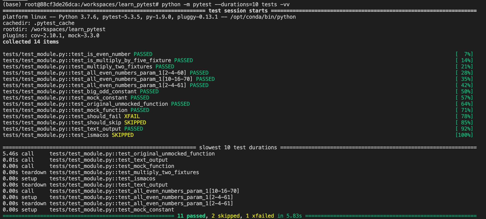

# learn_pytest
Adapted and reused:
- Dockerfile
- requirements.txt
- requirements-test.txt 
- devcontainer.json
  
from https://www.dataraccoon.com/knowledge/testing

To cover: 
1. Fixture
2. Parametrize
3. Mocking
4. xfail
4. skip
5. skipif

Questions: 
1. When to use xfail vs skip test?
2. Generally, when to start developing tests (eg. after every function writing?) 
3. How to integrate test to CI/CD? 

# How to run
`python -m pytest --durations=10 -vv tests`

